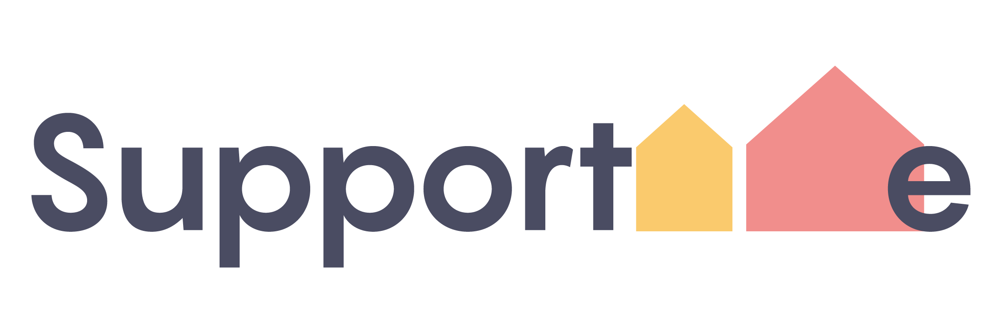
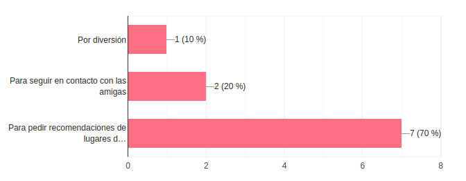

# SupportMe 

    Las mudanzas en las familias de los miembros de las Fuerzas Armadas del país es una constante a lo largo 
    de su vida, continuamente se estan de cambiando de un lugar a otro perdiendo contacto con los vecinos y 
    amigos. Aunado a esto cuando llegan a una nueva ciudad es dificil para las esposas (que son las que se 
    encargan del matenimiento de su hogar) conseguir referencias de buenas escuelas en el área, saber que 
    prestadores de servicios como electricistas, plomeros, mecánicos, con más recomendables o conocer dónde 
    estan ubicadas las plazas o tiendas más cercanas a su Unidad Habitacional. La comunicación entre ellas 
    actualmente es a través de grupos de Watsapp, pero estos grupos solo se limitan a la Unidad donde viven.

    
  

    SupportMe es una red social dirigida a este grupo en particular de mujeres, cuya finalidad es encontrar 
    referencias de prestadores de servicios y compartir sus experiencias de las Unidades Habitacionales donde
    han vivido. A través de SupportMe pueden estar conectadas con todas las Unidades Habitacionales que 
    existen en el país.

## Definición de la App

    Con SupportMe te podrás mantener informada acerca del nuevo lugar donde viviras haciendo más fácil el 
    proceso de adaptación a tu nuevo hogar. Además te ayudará a mantener el contacto con antiguas amigas, 
    vecinas y/o conocidas.

#Definiendo los usuarios

    Se realizo una entrevista en 10 usuarias y se obtuvieron los siguentes resultados:

  - Todas las entrevistadas usarían la red social.

  

  -  El 70% de ellas utilizan las redes sociales para obtener información.

  

  - 

- Historia de usuario

    - **Historia 1**

       Yo como usuaria quiero saber para que me va a servir esta red social llamada *SupportMe*

        **Criterios de aceptación**
 
           - En la página de bienvenida se debe visualizar el logo de la red social para que la 
             usuaria se vaya familiarizando con la aplicación.

           - También debe visualizarse un texto corto de explicación sobre como ***SupportMe*** me 
             va a ayudar en mi problemática.

           - En esta página seben estar los dos botones para la opción de iniciar sesión (si ya es 
           usuaria de la red social) y botón de registro (si es una nueva usuaria).

    - **Historia 2**

       Yo como usuaria quiero crear una cuenta para utilizar ***SupportMe***.

        **Criterios de aceptación**
    
          - En la página de bienvenida debe visualizarse un botón de registro.

          - Este botón debe llevarme a otra pantalla en donde se le pidan sus datos de registro. Los datos 
            serían: Nombre, e-mail, username, contraseña, confirmación de contraseña, estado (select), ciudad
            (select) y unidad habitacional (select).

          - También esta pantalla debe contener un botón de "REGISTRAR" que al dar *click* en él se almacenará
            y verificará la información.

    - **Historia 3**

       Yo como usuaria quiero iniciar sesión en ***SupportMe***, de una manera sencilla y rápida.

        **Criterios de aceptación**

          - En la página de bienvenida debe visualizarse un botón de inicio de sesión.

          - Al dar *click* en éste botón la aplicación deberá lanzar un modal en donde se le solicite al
            usuario su e-mail y contraseña, además en este modal también debe de haber la opción de incio 
            rápido con correo de gmail o con la cuenta de Facebook de la usuaria.

          - Finalmente en este modal debe de haber un botón de "iniciar" (o cualquier otro nombre) que al dar 
            *click* verifique si los datos que ingresó la usuaria sean   correctos para darle acceso a 
            ***SupportMe***.

          - Si los datos no son correctos o la usuaria no se ha registrado aún debe visualizarse un mensaje 
            que informe lo que está pasando para que la usuaria pueda corregir la información.

    - **Historia 4**

       Yo como usuaria quiero visualizar mi información en mi perfil y además visualizar la información de mis contactos.

         **Criterios de aceptación**

           - Al iniciar sesión o registrarse en la aplicación se tendrá que visualizar el perfil de la 
             usuaria y al mismo tiempo su “muro”.

           - En el head debe haber un “botón” que lleve al timeline para visualizar las publicaciones de las 
             otras usuarias y también contener la opción de cerrar sesión.

           - La parte del perfil debe contener la siguiente información: Foto, nombre y ubicación actual.

           - En el “muro” debe visualizarse las quejas y recomendaciones que ha escrito la usuaria.

    - **Historia 5**

       Yo como usuaria quiero postear una duda en mi “muro“ que aparezca en el timeline para que pueda ser contestada.

    - **Historia 6**

       Que pueda recibir comentarios/recomendaciones de las otras usuarias.

    - **Historia 7**

       Que la usuaria pueda dar like a comentarios o ecomendaciones que le sean de utilidad/le gusten.

    - **Historia 8**

	     Que la usuaria pueda eliminar algún post (si ya no quiere hacer esa consulta).

    - **Historia 9**

       Que la red social lance un mensaje de confirmación para eliminar el post.

    - **Historia 10**

       Que la usuaria pueda editar alguna publicación, si desea replantear la consulta o si cometió un error/dedazo.

